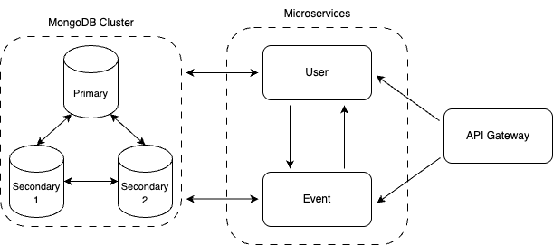

# 이벤트/보상 관리 플랫폼

## 필요한 기술 스택

* Node 18
* Docker & Docker Compose

## 실행 방법

```shell
# 1. Docker Compose 실행
docker compose up --build -d

# 2. Docker Compose 종료(모든 데이터 삭제되므로 주의)
docker compose down -v
```

위 명령어를 이용하여 도커 환경을 만들어주세요.

정상적으로 도커 환경이 만들어지면 아래와 같은 컨테이너 6개가 생성됩니다.

1. MongoDB(Primary)
2. MongoDB(Secondary - 1)
3. MongoDB(Secondary - 2)
4. API(api-gateway)
5. API(user-service)
6. API(event-service)

서버 실행 후 아래 링크로 API 문서를 확인할 수 있습니다.

* http://localhost:3000/api-docs

## 서버 구조



Docker를 이용하여 서버를 구축하면 위와 같은 구조로 구성됩니다.

실제 운영 환경에서는 각 서비스(user-service, event-service)별로 독립적인 MongoDB Cluster가 구성되어야 하지만, 개발 환경의 편의성을 위해 단일 MongoDB Cluster로 통합하여 구성했습니다.

## 주요 기술적 도전과 해결

### 이벤트 보상 중복 지급 방지 구현

- **문제**: 동일 유저의 이벤트 보상 지급 요청이 동시에 발생할 경우 중복 지급 문제 발생
- **해결**:
  - MongoDB 트랜잭션을 활용한 원자적 연산 구현
    - 트랜잭션 실패 시 자동 롤백 처리
    - 이벤트 보상 지급과 이력 생성의 원자적 처리
    - [관련 로직](/apps/events/src/services/claim-histories.service.ts#L53)
  - 분산락 구현을 통한 동시성 제어
    - MongoDB TTL 인덱스(60초 만료)를 활용한 분산락 구현
    - Lock 알고리즘을 이용하여 원자적 보상 지급 보장
    - [관련 스키마](/apps/events/src/schemas/lock.schema.ts#L1), [관련 로직](/apps/events/src/services/claim-histories.service.ts#L61)
  - 동시성 테스트를 통한 검증
    - 락 획득 실패 시 적절한 에러 처리 검증
    - [관련 테스트 코드](/apps/api-gateway/test/events.e2e-spec.ts#L26)
- **개선 방안**
  - Redis를 활용한 분산락 구현으로 성능 개선
  - 멱등성 보장(현재 로직은 409 에러 반환)

### 확장성 있는 이벤트 도전과제 구축

- **문제**: 다양한 유형의 도전 과제(로그인 횟수, 아이템 보유, 캐시/코인 보유 등)를 유연하게 처리해야 함
- **해결**:
  - Mongoose Discriminator를 활용한 스키마 설계
    - 도전 과제 타입별 독립적인 [스키마](/apps/events/src/schemas/challenge.subschema.ts) 정의
  - 타입 안전성 보장
    - DTO 레벨에서의 [유효성 검사](/libs/protocol/src/events/event.dto.ts#L23)
    - 도전 과제 타입별 [충족 조건 검증](/apps/events/src/services/claim-histories.service.ts#L166) 로직 구현

## 비고

  - Node 18 버전과 호환되는 NestJS 관련 라이브러리들을 사용했습니다. (11.x 버전은 지원하지 않습니다)
  - 테스트 코드 실행은 앞서 언급한 도커 환경을 구축한 후 `npm run test:e2e` 명령어를 입력해주세요.
  - 도커 환경이 아닌 로컬 환경에서 서버를 구축하고 싶으시다면 아래 단계를 따라주세요:
    1. 유닉스 계열인 경우 `/etc/hosts` 파일, 윈도우 계열인 경우 `C:\Windows\System32\drivers\etc\hosts` 파일을 열어 `127.0.0.1`에 `mongo1, mongo2, mongo3`를 추가하여 루프백을 설정해주세요.
    2. `docker compose -f docker-compose.only-mongodb.yml up -d` 명령어를 이용하여 MongoDB Cluster 환경을 구축해주세요.
    3. `npm run start:all:dev` 명령어로 3개의 서버를 실행해주세요.